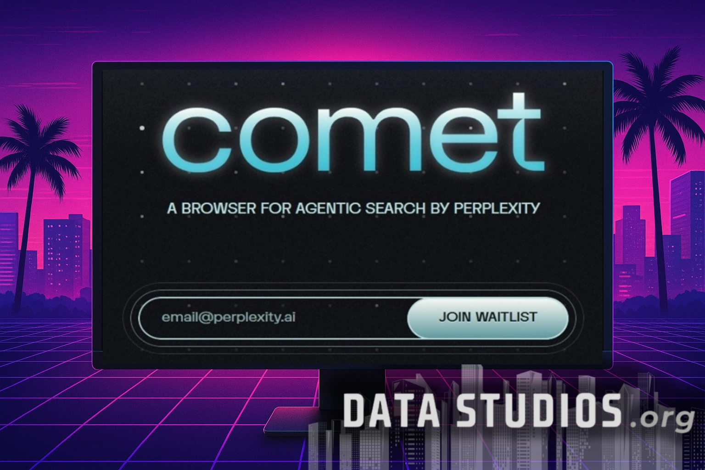

# Perplexity AI Launches Comet: A New AI-Powered Browser Now Testing on Windows

---

If you've ever felt overwhelmed by endless browser tabs, vague search results, or the constant juggling between apps just to find one piece of information, you're not alone. Perplexity AI's new browser, Comet, is now available for early testing on Windows—bringing AI-powered search, smart tab management, and instant summarization right into your everyday browsing. After a successful Mac beta, this Windows rollout means more users can experience a browser that actually understands what you're looking for and helps you stay organized without the usual chaos.

---

## A Browser That Actually Talks Back

So what's the big deal with Comet? Well, it's not just another browser with a fresh coat of paint. Instead of treating you like someone who needs to click through ten blue links to find an answer, Comet acts more like a helpful friend who already knows what you're after.

You type in a question—like you're texting someone—and Comet gives you a straight answer. No scrolling through pages of ads and fluff. No opening five tabs just to compare information. It's designed to respond in plain language, pulling together what you need and presenting it clearly. Think of it as having a research assistant built right into your browser, one that doesn't take coffee breaks.

The whole experience feels less like "searching the web" and more like "asking someone who actually knows." And honestly? That's a nice change.

## What Comet Brings to the Table

Let's talk features. Comet isn't trying to reinvent the wheel—it's just making the wheel a lot smarter.

**Search that understands you:** You can ask full questions, the kind you'd ask a real person. Comet processes them and gives you direct, easy-to-digest answers. No need to play keyword roulette or rewrite your query five times.

**Instant summaries:** Got a long article or a dense report? Comet can summarize it for you, pulling out the key points so you don't have to skim through paragraphs of filler. It's like having Cliff's Notes for the entire internet.

**Smart memory:** Ever tried to find that one article you read last Tuesday but can't remember the exact title? Just ask Comet. It keeps track of your browsing history in a way that's actually useful, so you can retrieve things by describing them, not by remembering exact URLs.

**Tab management that doesn't suck:** If you're the type who ends up with 47 open tabs by lunchtime, Comet's got your back. It can group tabs by topic, close the ones you're done with, and generally keep your workspace from turning into a digital landfill.

**Chrome extension support:** Because Comet is built on Chromium, all your favorite Chrome extensions still work. No need to give up the tools you rely on just to try something new.

👉 [See how Perplexity AI is changing the way people search and browse online](https://pplx.ai/ixkwood69619635)

## Windows Users, Your Turn

Comet started life on Mac, specifically for users with Apple Silicon chips. Perplexity AI used that initial rollout to gather feedback, fix bugs, and fine-tune the experience. Now, in June 2025, they're opening the doors to Windows users—a much larger audience that includes everyone from students to remote workers to enterprise teams.

This is a big move. Windows dominates the desktop market, and bringing Comet to this platform means the browser can reach the people who need it most: those juggling work, research, and personal projects on a daily basis.

The company is rolling out access through an early beta program. Interested users can sign up on the official Perplexity AI website, and invitations are being sent out in waves. This staged approach lets the team manage feedback, squash bugs, and make sure the experience is solid before opening the floodgates.

## How to Get Early Access

Getting your hands on Comet is pretty straightforward. Perplexity AI has set up a waitlist on their website where you can register your interest. You'll need to provide your email and a few details about your setup—operating system, typical browsing habits, that sort of thing. This helps the team pick a diverse group of testers, from casual users to tech-savvy folks who can really put the browser through its paces.

Once you're on the list, you'll get a confirmation email explaining what happens next. Invitations go out in stages, so don't panic if you don't hear back immediately. When your turn comes, you'll receive a download link for the Windows version of Comet, along with installation instructions and some tips to get you started.

The early access version includes most of Comet's core features. You'll be able to try out AI-powered search, summarization, tab management, and privacy settings. There are built-in feedback tools, so if you run into a bug or have a suggestion, you can report it directly to the Perplexity team. Your input actually matters here—early testers are treated like collaborators, not just guinea pigs.

Expect occasional updates and surveys as new features roll out. By joining the early access program, you're not just getting a sneak peek—you're helping shape the future of the browser.

## Who's Behind This?

Perplexity AI isn't some fly-by-night startup. The company has built a solid reputation for making information more accessible and accurate. Their question-answering systems are used by individuals, professionals, and businesses around the world, and they've earned trust by delivering clear, sourced answers instead of vague AI-generated fluff.

The team includes experts in artificial intelligence, machine learning, and user experience. Their goal has always been to help people interact with information naturally, using technology that feels intuitive rather than intimidating. Over the years, Perplexity's tools have become known for being fast, reliable, and transparent about where their answers come from.

## What Makes Perplexity AI Different?

There's no shortage of AI tools out there, but Perplexity AI stands out for a few key reasons.

**Sourced answers:** Unlike some platforms that spit out generic text with no context, Perplexity always points to the original sources when possible. You can check the facts yourself, which builds trust and makes the tool genuinely useful for research and decision-making.

**User-first design:** Perplexity's system is built to work *with* you, not just *for* you. It responds to real queries with actionable summaries and suggestions, not just walls of text. The platform is regularly updated based on user feedback, so it stays relevant and useful.

**Privacy matters:** Perplexity AI doesn't use individual user data for model training. Privacy and user control are baked into the design, which is a big deal in an era where most AI platforms are notoriously opaque about how they handle your information.

## Why Build a Browser?

You might be wondering: why did Perplexity AI decide to build a browser in the first place? After all, there are plenty of browsers out there already.

The answer is simple. Most people spend their entire day in a browser, but they're still forced to juggle multiple apps, search engines, and websites just to get things done. Perplexity saw an opportunity to streamline that process by putting advanced AI features directly into the tool people already use most.

By building Comet, Perplexity can offer a seamless experience where searching, organizing, and learning all happen in one place. The AI is there at every step—reading articles, managing tabs, remembering past activities, providing instant summaries—without forcing you to leave your workflow or switch between disconnected tools.

It's also about giving users more power and choice. With Comet, Perplexity can ensure that privacy features, customization, and intelligent help are always front and center, setting a new standard for what browsing should feel like in the age of AI.

👉 [Discover why Perplexity AI is the go-to platform for smarter, faster information access](https://pplx.ai/ixkwood69619635)

---

## Wrapping Up

Comet represents a fresh take on web browsing, one that puts AI-powered assistance right where you need it most. With features like natural language search, instant summarization, smart tab management, and strong privacy protections, it's designed to make your online life easier and more productive. The Windows early access program is your chance to try it out, share feedback, and help shape the future of the browser. If you're tired of the same old browsing experience and want something that actually understands what you're looking for, Comet is worth a look—and Perplexity AI's track record of delivering clear, sourced, and trustworthy information makes it a solid choice for anyone serious about getting things done online.
